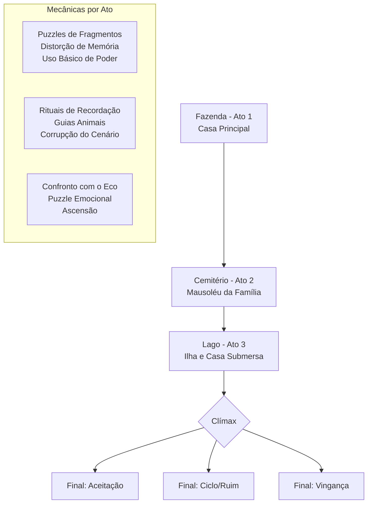

# GDD: O Eco da Servidão (The Echo of Servitude)

## 1. Visão Geral

| Campo | Detalhe |
| :--- | :--- |
| **Título** | O Eco da Servidão |
| **Gênero** | Terror Psicológico, Puzzle, Exploração, Drama |
| **Plataforma** | PC (Windows) |
| **Engine** | Godot 4.3+ |
| **Público-alvo** | Fãs de *What Remains of Edith Finch*, *Hellblade*, *Journey* |

**Conceito Central:** Uma mulher retorna à fazenda da infância para investigar a morte misteriosa de sua mãe. Ao explorar a casa, o mausoléu e uma ilha isolada, ela descobre que herdou um poder divino adormecido, mas que usá-lo fortalece seu "Eco" - uma manifestação de sua culpa e exaustão existencial.

## 2. Narrativa e Estrutura

### 2.1 Personagens

| Personagem | Descrição | Inspiração Visual | Animações (Mixamo) |
| :--- | :--- | :--- | :--- |
| **Elara (Jogável)** | Mulher, ~30 anos. No início: cansada, manto neutro. No clímax: ascendida, corpo holográfico. | *Journey* (início) / *Viktor (Arcane)* (final) | Idle (cansada), Walk, Run, Double Jump, Levitação (planar). |
| **O Eco** | Sombra que segue Elara. Passiva no início. Quanto mais poderes usados, mais agressiva e vermelha fica. | Sombra distorcida, olhos vazios, contornos pulsantes. | Idle (observando), Chase (perseguição lenta), Transformação. |
| **Mãe (Memória)** | Aparece em flashes. Usava o mesmo poder, mas foi drenada. | Figura minimalista, bege, transparente. | Gestos de exaustão, cair. |

### 2.2 Fluxo de Fases

### 2.3 Os Três Atos e Seus Cenários

| Ato | Local | Estilo Visual (Base) | Mecânica Principal |
| :--- | :--- | :--- | :--- |
| **1** | Casa da Fazenda | Minimalista calmo → Preto/vermelho | Coleta de fragmentos + distorção de memória |
| **2** | Mausoléu + Cemitério | Gótico + Livros flutuantes | Rituais de recordação + guias animais |
| **3** | Ilha + Casa Submersa | Contraste extremo (vivo x morto) | Confronto com o Eco + puzzle emocional |

## 3. Design de Níveis e Objetos 3D (para Meshy AI)

### 3.1 Objetos de Cenário (Prioridade Alta)

| Objeto | Ato | Prompt para Meshy AI | Formato Export |
| :--- | :--- | :--- | :--- |
| **Poltrona Velha** | Ato 1 | *"Old worn-out armchair, Victorian style, ripped fabric, dust particles, stylized low-poly, game asset, beige and dark brown colors, isolated on white background"* | FBX |
| **Relógio de Bolso Quebrado** | Ato 1 | *"Broken pocket watch, cracked glass, rusty gears visible, chains, stylized game prop, steampunk influence, dark bronze color, isolated on white"* | FBX |
| **Livro de Diário (Mãe)** | Ato 2 | *"Old leather journal, worn edges, metal clasp, mystical symbols on cover, stylized prop, dark red and gold colors, isolated"* | FBX |
| **Lápide com Livro** | Ato 2 | *"Gothic tombstone, weathered stone text, an open book carved on top, glowing ethereal pages, stylized low-poly, gray and moss green"* | FBX |
| **Coração de Memória (Chave Visual)** | Ato 3 | *"Glowing crystal heart, cracked, pulsating red light inside, floating, stylized energy core, game asset, dark red and black"* | FBX |
| **Máscara Ancestral (NPC)** | Ato 2 | *"Tribal wooden mask, mystic carved patterns, stylized art, floating, neutral beige and gray, game prop, isolated"* | FBX |

### 3.2 Personagens e Criaturas (Prioridade Média)

| Personagem | Prompt para Meshy AI | Animação (Mixamo/Meshy) |
| :--- | :--- | :--- |
| **Elara (Base)** | *"Stylized young woman in hooded cloak, tired expression, minimalist design, Journey game inspiration, neutral beige and gray colors, T-pose, game character"* | Usar **Mixamo**  para: *Idle (Exhausted)*, *Walking*, *Running*. |
| **Corvo Místico (NPC Guia)** | *"Mystical crow with three eyes, feathers made of moss and stone, stylized creature, minimalist, gray and dark green, T-pose, game character"* | Usar **Meshy Animate**  com preset *Flying* ou *Idle*. |
| **O Eco (Sombra)** | *"Featureless shadow creature, humanoid but distorted, dripping black smoke, red glowing cracks, menacing pose, stylized monster"* | Usar **Meshy Animate** com preset *Idle_aggro* e *Chase*. |

### 3.3 Dicas de Modelagem (Meshy AI)

1.  **Use Image to 3D:** Se tiver um sketch ou arte conceitual (pode gerar no ChatGPT/DALL-E), faça upload na Meshy. O resultado é muito mais fiel que apenas o texto .
2.  **Prefira `.fbx` com Texturas Inclusas:** Ao baixar, escolha o formato `.fbx` e marque a opção para incluir as **texturas**. A Meshy gera UVs e texturas automaticamente, o que é excelente .
3.  **Otimize a Contagem de Polígonos:** Para Godot, escolha a opção "Low Poly" ou "Game Ready" durante a geração para não pesar o desempenho.
4.  **Estratégia de Estilo:** Para o jogo, prefira estilos mais *stylized* e *minimalistas* a photorealistic . Funciona muito bem com a ambientação de terror psicológico e consegue uma identidade visual única.

## 4. Mecânicas e Sistemas (Godot)

### 4.1 Sistema de Poder e Corrupção (O Eco)

Esta é a mecânica central. Ela conecta a jogabilidade à narrativa.

- **Poderes:**
    - **Telecinese Fraca:** Segurar e mover objetos leves (chaves, livros). Resolve puzzles.
    - **Double Jump:** Acessar áreas mais altas (sótão, prateleiras altas).
    - **Planar (Glide):** Cruzar gaps no chão, principalmente no Ato 3.

- **Medidor de Corrupção (Eco):**
    - **O que aumenta:** Usar qualquer poder. Quanto mais usa, mais a barra enche.
    - **Efeitos Visuais:**
        - *0-30%:* Cenário normal (estilo Journey).
        - *30-70%:* Cantos da tela escurecem, paredes começam a mostrar manchas vermelhas.
        - *70-99%:* O cenário fica predominantemente preto e vermelho. Objetos flutuam. O "Eco" aparece andando lentamente em direção à Elara.
        - *100%:* **Game Over (Loop).** O Eco te alcança. O jogo reinicia o ato, mas com uma mensagem sombria na tela.

### 4.2 Sistema de Puzzle por Ato

| Ato | Tipo de Puzzle | Exemplo Concreto (Godot) |
| :--- | :--- | :--- |
| **1** | **Coleta de Fragmentos** | 4 fragmentos de chave espalhados. Um está atrás de um quadro. Para pegá-lo, use Telecinese para derrubar o quadro. |
| **2** | **Ritual de Recordação** | Uma sala com 3 pedestais. Use Telecinese para colocar os objetos corretos (Pente, Chávena, Livro) em cada um. A ordem está nas dicas do diário. |
| **3** | **Puzzle Emocional (Clímax)** | O Eco tem um peito rachado. Para derrotá-lo, você deve usar Telecinese para "puxar" os nós de energia (esferas vermelhas) que se formam ao redor dele. Cada nó puxado é uma memória dolorosa que Elara aceita. |

### 4.3 Implementação Técnica no Godot

- **Controle do Personagem:**
    1.  Importe o modelo `.fbx` de Elara para o Godot.
    2.  Crie um `CharacterBody3D` e adicione um `AnimationTree`.
    3.  Configure o **AnimationTree** com um `BlendSpace2D` para controlar a transição entre *Idle*, *Walk* e *Run* baseado na velocidade.
    4.  Use o plugin de **Retargeting** para aplicar as animações do Mixamo .

- **Sistema de Poder (Telecinese):**
    - Use `RayCast3D` para detectar objetos interagíveis.
    - Use um `RigidBody3D` para os objetos móveis.
    - O código de telecinese é basicamente: `object.global_position = lerp(object.global_position, hit_point, 10.0 * delta)`

- **Sistema de Corrupção (Shaders):**
    - Crie um **Shader Material** para o cenário.
    - O shader deve ter um parâmetro `mix_factor` que varia de 0 a 1.
    - Em 0: mostra a textura original (estilo Journey).
    - Em 1: mistura a textura com uma cor vermelha e aumenta o contraste.
    - Um `Global Script` controla o `mix_factor` baseado no uso de poder.

## 5. Arte e Estilo Visual (Texturas e Estética)

| Estilo | Inspiração | Uso no Jogo |
| :--- | :--- | :--- |
| **Neutro / Calmo** | *Journey* | Cenário normal, exploração. Cores bege, cinza, verde musgo. |
| **Corrompido / Hostil** | *Preto e Vermelho* | Quando o medidor de Eco está alto. Paredes com texturas de "veias" vermelhas. |
| **Ascensão Final** | *Viktor (Arcane)* | No clímax, Elara e o cenário ganham detalhes holográficos e brilho azul/roxo. |

## 6. Áudio e Texturas (Onde Encontrar Assets Gratuitos)

### 6.1 Onde Encontrar Texturas e Materiais Grátis

| Site | Tipo de Conteúdo | Link / Observação |
| :--- | :--- | :--- |
| **AmbientCG** | Texturas PBR (físicas) de madeira, pedra, parede, metal. | Altamente recomendado. Tudo CC0 (domínio público). |
| **OpenGameArt.org** | Texturas 2D, sprites, tilesets, artes conceituais. | Ideal para UI, ícones e arte conceitual estilizada . |
| **Kenney.nl** | Pacotes de assets completos, incluindo prototipagem 3D e texturas simples. | Conhecido pela qualidade e licença CC0 . |
| **Poly Haven** | Texturas PBR e HDRI (céus) em altíssima resolução. | Completamente grátis, sem registro. Ótimo para iluminação ambiente. |

### 6.2 Onde Encontrar Sons e Música Grátis

| Site | Tipo de Conteúdo | Para que usar |
| :--- | :--- | :--- |
| **Freesound.org** | Efeitos sonoros diversos (portas rangendo, passos, vidro quebrando). | **Ambientação e SFX.** Verifique a licença de cada som . |
| **Kenney UI Audio** | Pacote de sons de interface (botões, cliques, switches). | **UI do jogo** . |
| **Incompetech (Kevin MacLeod)** | Música instrumental de alta qualidade. | **Trilha sonora.** Exige crédito (CC-BY) . |
| **Mixkit.co** | Efeitos sonoros e música, tudo grátis. | Interface fácil. Boa curadoria . |
| **Soniss** | Pacotes de efeitos sonoros gratuitos para jogos. | Ótimo para sons de ambiente e passos. |

### 6.3 Sites para Buscar Assets no Geral

| Site | Descrição |
| :--- | :--- |
| **Itch.io (Assets Grátis)** | Centenas de desenvolvedores oferecem pacotes de assets de graça para suas comunidades . |
| **GitHub (Awesome Gamedev)** | Repositório curado com listas enormes de recursos gratuitos para tudo . |

## 7. Pipeline de Produção Recomendado

Este é o passo a passo que sugiro para você começar a produzir o jogo de forma eficiente:

1.  **Dia 1-2 (Prototipagem):**
    - Crie um projeto Godot 4.3.
    - Configure o plugin **Mixamo Animation Retargeter** .
    - Baixe um modelo humanoide grátis (ex: YBot) e algumas animações do Mixamo (Idle, Walk).
    - Faça o `CharacterBody3D` se movimentar.

2.  **Dia 3-5 (Assets Principais):**
    - Use a **Meshy AI** para gerar a **Poltrona**, o **Relógio** e o **Coração de Memória** .
    - Faça o download das texturas de parede e chão do **AmbientCG**.
    - Monte uma sala de teste no Godot (um cubo como chão, uma parede).

3.  **Dia 6-8 (Mecânicas Nucleares):**
    - Implemente o **RayCast** para detectar objetos.
    - Implemente a **Telecinese** simples (objeto segue o mouse).
    - Crie o **Shader** de corrupção e o script de controle do medidor.

4.  **Dia 9-14 (Níveis Completos):**
    - Gere os assets de cada ato (Mausoléu, Ilha, Corvo, Eco).
    - Construa as cenas no Godot.
    - Implemente os puzzles de fragmentos e rituais.

5.  **Dia 15+ (Áudio e Polimento):**
    - Baixe sons de passo, vento, rangidos do **Freesound**.
    - Implemente com `AudioStreamPlayer3D`.
    - Adicione a trilha sonora do **Incompetech**.
    - Teste e refine a dificuldade e o ritmo da narrativa.
